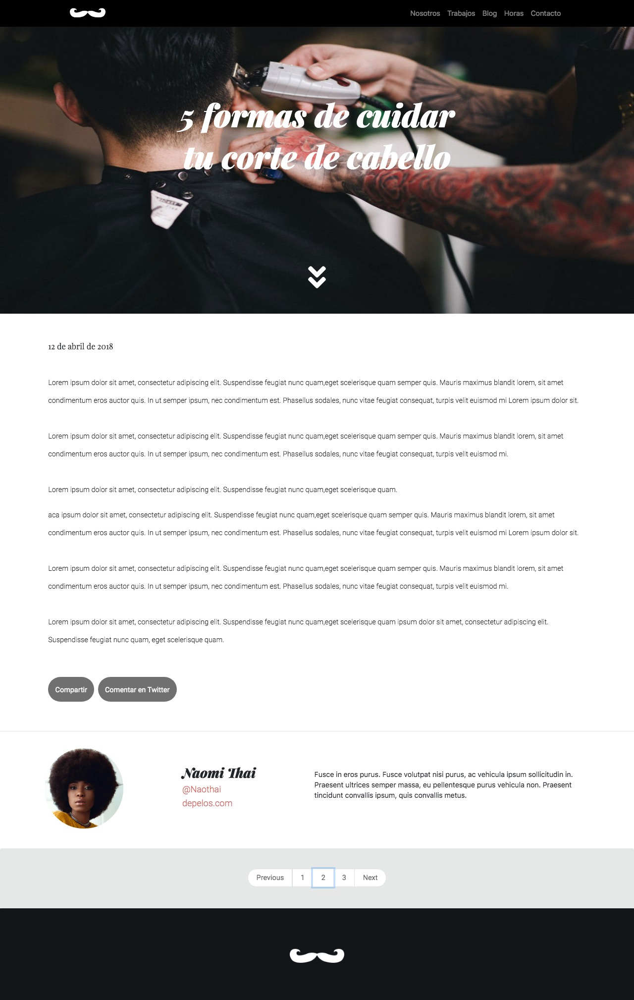
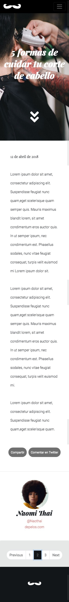

# Blog BarberShop

> Página web  usando Bootstrap Sass a modo de aprovechar la gran cantidad de componentes y clases que aliviarán tu trabajo.

## Instrucciones.

Un día como hoy llega la noticia a tu equipo que deben diseñar y maquetar en tiempo record una
página web, específicamente una entrada de blog para el nuevo sitio de la barbería llamada
"BarberShop".
Para hacerlo el equipo de diseñadores UX/UI creó de manera rápida y prolija la interfaz de usuario
con la interfaz de usuario requerida por el cliente.
Las representaciones que entregan los diseñadores están en el archivo Apoyo Desafío - Blog
Barbershop
Así, teniendo a disposición todos los elementos para maquetar la página web decides crear esta
usando Bootstrap Sass a modo de aprovechar la gran cantidad de componentes y clases que
aliviarán tu trabajo.

## Requisitos
 
- Crear estructura de directorio base del proyecto (0.05 puntos)
- Crear directorios necesarios para el proyecto
- Crear documento HTML
- Crear directorios para imágenes, Sass y CSS
- Crear archivo CSS a compilar
- Agregar imágenes del proyecto
- Crear estructura de proyecto para Sass usando el patrón 7-1 (0.05 puntos)
- Crear directorios del patrón 7-1
- En el caso de no usar un directorio mantener vacío
- Separar lógica visual del proyecto usando parciales, directivas @import y manifiesto (0.15
puntos)
- Crear archivos parciales necesarios para el proyecto
- Crear manifiesto del proyecto Sass
- Agregar parciales en manifiesto usando la directiva @import
HINT: Los @imports deberán seguir un orden mencionado en https://sass-guidel
in.es/#architecture
- Integrar Bootstrap Sass para usar sus funcionalidades en la maqueta (0.15 puntos)
- Seleccionar los archivos de necesarios para implementar Bootstrap Sass en proyecto
- Agregar archivos en directorio vendors
- Integrar manifiesto de Bootstrap Sass en proyecto usando directiva @import
- Recuerda seguir el orden de los archivos parciales en el manifiesto principal del
proyecto
- Construir estructura HTML utilizando etiquetas semánticas (0.10 puntos)
- Utilizar a lo menos 3 etiquetas semánticas como header , section , footer , nav o
article
- Crear clases semánticas utilizando nomenclatura BEM (0.10 puntos)
- Agregar una clase de bloque en la sección del autor de la entrada, una clase de elemento
en la descripción y un elemento modificador en los links de la sección
Implementar dos componentes de Bootstrap tales como navbar , paginación , cards o
botones (0.15 puntos)
- Traspasar valores de la guía de estilos a variables de Sass
- Agregar variables de colores, fuentes, tamaño y grosor de fuentes siguiendo la guía de
estilos
- Utilizar a lo menos 5 variables en el proyecto
- Crear estilos base del proyecto (0.5 puntos)
- Agregar estilos reset al proyecto
- Agregar estilos base para tipografías del proyecto
- Identificar elementos que constituyen la página del proyecto web (0.5 puntos)
- Definir los estilos a en la página
- Crear parciales para la página
- Identificar colores de fondo usados en representación visual
- Agregar colores de fondo a elementos del layout como header , secciones y footer
- Definir reglas a CSS/SCSS a utilizar en la página
- Crear estilos para componentes del proyecto web (0.5 puntos)
- Identificar componentes a dar estilos
- Crear parciales para componentes
- Denifir reglas CSS/SCSS a utilizar componentes
- Utilizar nesting para crear estilos en pseudo selectores (0.10 puntos)
- Agregar nesting en componentes que requieran cambio de estado utilizando &
